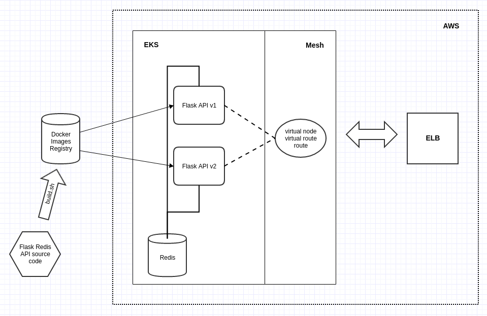

# Flask API with Redis storage & canary deployment with AWS Mesh on EKS



Clone this repository.

## Building & pushing Docker images

For this task, we use REST API built through Python and Flask. These services are packaged as Docker container images.

Feel free to explore the code available.

If you want to use images stored in your own Docker Hub account, go ahead and push the images after building them. In case you want to try it without building and pushing the images, you can safely skip this step.

```bash
cd services
export DOCKER_HUB_USER='Your Docker HUB username'
./build.sh
cd ..
```

## Configuring AWS App Mesh

Before we deploy the microservices-based app in Kubernetes, we need to have the App Mesh configuration in place. This will set up the control plane to deal with the network topology and routing rules.

Create the mesh and the entire topology with the following command (make sure you are in the `mesh` folder):

```bash
cd mesh
./create-mesh.sh
cd ..
```

This command creates the virtual nodes for `v1` of the service. A virtual router is configured for each virtual node pointing to the DNS name of the service. Each virtual router is associated with a route that drives traffic to the same virtual node.

You can look at the JSON documents in the service directory with the definition of virtual node, virtual router, and routes.

At this point, we have the baseline mesh configuration for the `v1` of our application which will be deployed in EKS.

## Launch an Amazon EKS Cluster

t2.medium, one node EKS cluster is sufficient. Let’s launch it in US-West-2 region by running the script that invokes eksctl utility:

```bash
cd k8s
./launch-cluster.sh
```

Wait till the single-node cluster is provisioned and ready for use.

## Deploy Redis

First of all, deploy Redis in EKS:

```bash
cd k8s
./deploy-redis.sh
```

## Deploy v1 of the application

With the App Mesh and EKS cluster in place, we are all set to deploy and test our app.

In case you want to use custom images pushed to your own Docker Hub account, update the Kubernetes artifacts with the image name by running the script `./config-deploy.sh`.

Go to the Kubernetes folder and execute the below command: `./deploy-v1.sh`

The service is exposed via an elastic load balancer (ELB).

Notice that the service of the application is reflecting version 1.0. Now, it’s time for us to perform a canary deployment of v2 microservice.

## Canary deployment of v2

After making sure that you are in the `mesh` folder, execute the below command to create a virtual node for v2: `./update-mesh-v2.sh`

Now, deploy the Kubernetes pod for v2 which is already mapped to the v2 virtual node in App Mesh:

```bash
cd k8s
./deploy-v2.sh
```

This creates a deployment and a new service endpoint for v2.

Finally, let’s roll out the App Mesh policy to route 25 percent of the overall traffic to v2:

```bash
cd ../mesh
./deploy-canary-v2.sh
```

When you repeatedly access the service through the ELB, you can see that version of the service is reflecting 2.0.

Open the file `canary.json` file, located at `mesh/v2` folder. Update the weights to 50 for the virtual node.

Apply the updated policy to App Mesh by executing the `deploy-canary-v2.sh` script.

When you hit the ELB this time, you will notice that every alternate request is served by v2 microservice.

Continue to play with the traffic split and see the magic. The best thing about this scenario is the zero downtime to the application while deploying and routing the traffic to new versions.

Finally, clean up the resources by deleting the EKS cluster and App Mesh resources with the below commands:

```bash
./mesh/delete-mesh.sh
./k8s/remove-deploy.sh
./k8s/delete-cluster.sh
```

Hope this implemetation and walkthrough useful.

As AWS App Mesh moves towards general availability, we can see additional features and integrations becoming available.
